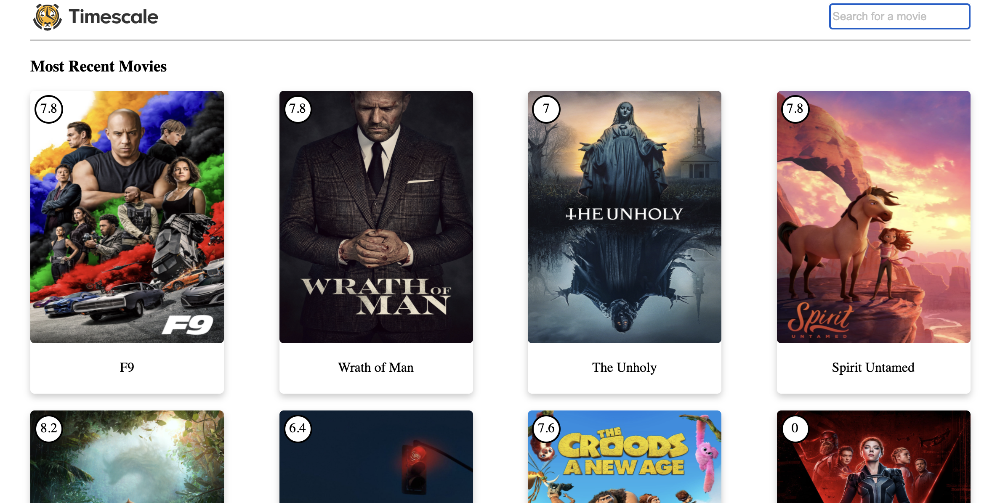

# A simple application communicating to a movies api

This application retrieves the most recent movies from The Movie DB and displays them in a grid. This displays my design skills without was CSS. Also, search through the list to update the grid. Click on one of the movies to get specific information on that movie.

### Commands

##### Running Locally

To run this application you must

- `npm i`
- `npm start`

    

